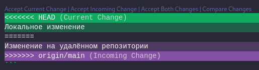

# Как слить origin и локальный репозиторий если случился кринж? 

## Куда я жмал...

Представим ситуацию. Базовую, так скажем. Вы работаете в `git` репозитории, есть локальная и удалённая копия (пусть это будет `github`, но это не важно).

В один прекрасный день Вы делаете коммит на удалённом репозитории, потом коммит на локальном... и вдруг понимаете, что забыли перед этим запулить ветку... и прекрасный день превращается в ночной кошмар!

При попытке запушить/запуллить изменения вы получаете тонну ничего-не-понятного, и единственное, чего хочется в эту секунду - чтобы это исчезло обратно!

\*Архивное фото автора, когда у него это случилось впервые, фото в цвете\*


Пример вывод команд `pull`/`push` в таких случаях:

```console
$ git pull origin main
remote: Enumerating objects: 5, done.
remote: Counting objects: 100% (5/5), done.
remote: Compressing objects: 100% (2/2), done.
remote: Total 3 (delta 0), reused 0 (delta 0), pack-reused 0
Unpacking objects: 100% (3/3), 999 bytes | 999.00 KiB/s, done.
From github.com:zhikh23/how-to-solve-merge-conflict
 * branch            main       -> FETCH_HEAD
   89bca42..ee3ee8f  main       -> origin/main
hint: You have divergent branches and need to specify how to reconcile them.
hint: You can do so by running one of the following commands sometime before
hint: your next pull:
hint: 
hint:   git config pull.rebase false  # merge
hint:   git config pull.rebase true   # rebase
hint:   git config pull.ff only       # fast-forward only
hint: 
hint: You can replace "git config" with "git config --global" to set a default
hint: preference for all repositories. You can also pass --rebase, --no-rebase,
hint: or --ff-only on the command line to override the configured default per
hint: invocation.
fatal: Need to specify how to reconcile divergent branches
```

```console
$ git push origin main
To github.com:zhikh23/how-to-solve-merge-conflict.git
 ! [rejected]        main -> main (non-fast-forward)
error: failed to push some refs to 'github.com:zhikh23/how-to-solve-merge-conflict.git'
hint: Updates were rejected because the tip of your current branch is behind
hint: its remote counterpart. Integrate the remote changes (e.g.
hint: 'git pull ...') before pushing again.
hint: See the 'Note about fast-forwards' in 'git push --help' for details.
```

<div style="page-break-after: always;"></div>

## Почему, а главное, за что?

Как так? Дело в том, что гит по умолчанию выполняет команды `pull/push` только в том случае, когда коммиты следуют друг за другом.

Поясняю для котиков.

Это работает нормально:
```
 C <-- main
 |
 |
 B <-- origin/main
 |
 |
 A
```

Здесь `A`, `B`, `C` - некоторые коммиты. `main` - текущее положение главной ветки, она же `master`. `origin/main` - положение главной ветки на _удалённом репозитории_. 

> Воспринимайте имена веток как "брелки", который навесили на коммиты, а не буквально "ветки". Да, в результате создания отдельной ветви в `git` на графике реально получится "ветвь"... но это частный случай.

Выполняем команду `git push`

```sh
$ git push origin main
```

Получаем:

```
 C <-- main, origin/main
 |
 |
 B
 |
 |
 A
```

Получаем успешный `fast-forward`! Команда `git push` просто провела "указатель" `origin/main` _вдоль линии коммитов_, и никаких ошибок не случилось.

А что же было у нас?

Мы создали репозиторий. Это коммит `A`. Далее сделали коммит `B` в удалённом репозитории и коммит `C` в локальном. Т.к. мы не проводили синхронизацию веток (под этим выражением я имею ввиду выполнение команд `git pull/push`), мы получаем следующую картину:

```
origin/main --> B  C <-- main
                | /
                |/
                A
```

Как видите, просто переместить _вдоль линии коммитов_ ни один из указателей не получится, поэтому попытки сделать `git pull` или `git push` не увенчаются успехом.

## Помощь котикам!

На такие случаи есть красивые решения (т.е. без удаления половины проекта и т.п.). Одно из таких я вам продемонстрирую)

### Создаём конфликт!

Для начала надо создать конфликт. Буквально.

Мы соединяем ветви `main` и `origin/main` в `main`. Для этого, будучи на ветке `main`, выполняем команду `git merge origin/main`:

```console
$ git merge origin/main
Auto-merging README.md
CONFLICT (content): Merge conflict in README.md
Automatic merge failed; fix conflicts and then commit the result.
```

Чуда... не случилось, магический `fast-forward` не сработал. К тому же, мы теперь ещё имеем конфликтующие файлы в репозитории!

```console
$ git status
On branch main
Your branch and 'origin/main' have diverged,
and have 1 and 1 different commits each, respectively.
  (use "git pull" to merge the remote branch into yours)

You have unmerged paths.
  (fix conflicts and run "git commit")
  (use "git merge --abort" to abort the merge)

Unmerged paths:
  (use "git add <file>..." to mark resolution)
        both modified:   README.md
```

### Выживет достойнеший

На моём примере с выдуманным `README.md`:

```
$ cat README.md
# how-to-solve-merge-conflict

<<<<<<< HEAD
Локальное изменение
=======
Изменение на удалённом репозитории
>>>>>>> origin/main
```

Любым доступным способом протыкиваем так, чтобы решить мердж-конфликт. Т.е. удалить все эти странные `>>>` и `===`, оставив только один, достойнейший вариант (или просто написать что-то среднее).

Пример на примере `VS Code`:



Фиксируем изменения коммитом:

```console
$ git add README.md
$ git commit -m "solve merge conflict"
[main 9289458] solve merge conflict
```

### Наука линейная

Что мы получили? Посмотрим на `git log`:

```console
$ git log
commit 92894583a92ec816cd213e7214150b2210076820 (HEAD -> main)
Merge: 08a9ad7 ee3ee8f
Author: zhikh <zhikh.k@gmail.com>
Date:   Wed Mar 6 19:56:19 2024 +0300

    solve merge conflict

commit 08a9ad70717e13001c87805bf1e7dc25e32290d2
Author: zhikh <zhikh.k@gmail.com>
Date:   Wed Mar 6 19:16:19 2024 +0300

    update README.md (local)

commit ee3ee8fd674aaa882b24090058e35ba94b3ad193 (origin/main, origin/HEAD)
Author: Kirill Zhikharev <130099896+zhikh23@users.noreply.github.com>
Date:   Wed Mar 6 19:16:03 2024 +0300

    update README.md (github)

commit 89bca42bc1ff616d15470a4a2c03bde8140079c7
Author: Kirill Zhikharev <130099896+zhikh23@users.noreply.github.com>
Date:   Wed Mar 6 19:14:36 2024 +0300
```

Что на схеме выглядит так:

```
 D <-- main
 |
 |
 C
 |
 |
 B <-- origin/main
 |
 |
 A
```

Как Вы можете заметить, теперь `origin/main` можно вдоль линии коммитов протянуть до `main`. Проверим это командой `git push`:

```console
$ git push origin main
Enumerating objects: 10, done.
Counting objects: 100% (10/10), done.
Delta compression using up to 16 threads
Compressing objects: 100% (4/4), done.
Writing objects: 100% (6/6), 640 bytes | 640.00 KiB/s, done.
Total 6 (delta 0), reused 0 (delta 0), pack-reused 0
To github.com:zhikh23/how-to-solve-merge-conflict.git
   ee3ee8f..9289458  main -> main
```

У нас получилось!

## Выводы

Что мы получаем:

- не забываем команды `git pull` перед началом работы с удалённым репозиторием;
- удалять половину репозитория из-за такой ошибки - плохая идея;
- "метки" веток перемещаются только вдоль линии коммитов;
- чтобы решить такой или похожий конфликт, нужно "выпрямить" ветку до прямой.

Удачи!)

## Пы.Сы.

Это "нечто" было создано в рамках проекта "Аполлон".

Автор сего чуда, как вы догадались, это я:
- [t.me/zhikhkirill](t.me/zhikhkirill)
- [vk.com/zhikh.localhost](https://vk.com/zhikh.localhost)
- [github.com/zhikh23](https://github.com/zhikh23)
